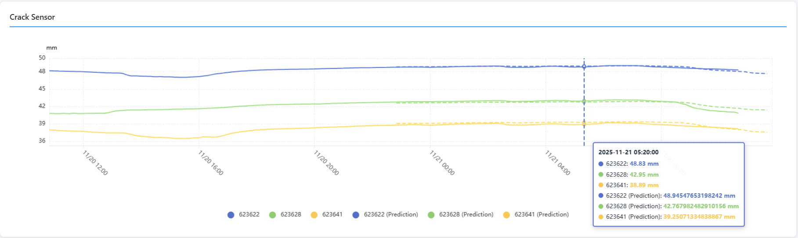
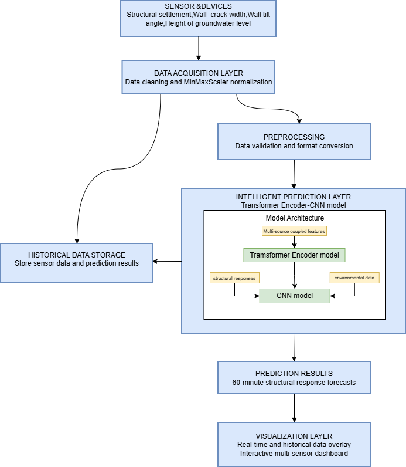
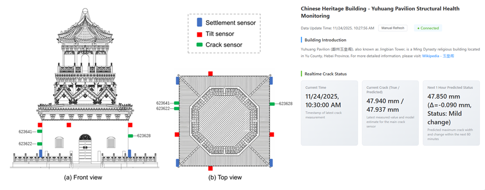

## 🏯 **Multi-Source Data Fusion and Hybrid Deep Learning for Structural Health Monitoring: Application to Yuhuangge Pavilion**

*A real-time visualization platform for multi-sensor structural health monitoring, built with Vue3 + TypeScript + Vite + ECharts.*

---

## 📘 Project Overview

The **SHM-System** is a web-based platform for visualizing real-time and historical structural health data, including settlement, tilt, crack width, and water level. It integrates multiple sensors and provides **trend analysis, automatic refresh, and predictive insights**. The system is suitable for historical building preservation, infrastructure monitoring, and research applications.

---

## 🛠️ Technology Stack

| Technology   | Purpose               |
| ------------ | --------------------- |
| Vue 3        | Front-end framework   |
| TypeScript   | Type-safe development |
| Vite         | Modern build tool     |
| Vue Router   | Routing               |
| Element Plus | UI component library  |
| ECharts      | Data visualization    |
| Axios        | HTTP client           |

---

## 🚀 Quick Start

### Requirements

* Node.js ≥ 18
* npm ≥ 9 or pnpm ≥ 8

### Install Dependencies

```bash
pnpm install
# or
npm install
```

### Run in Development Mode

```bash
pnpm dev
# or
npm run dev
```

Visit: [http://localhost:3000](http://localhost:3000)

### Build for Production

```bash
pnpm build
# or
npm run build
```

---

## 📂 Project Structure

```
SHM-System/
├── src/
│   ├── views/
│   │   └── Monitor.vue       # Core monitoring page
│   ├── main.ts
│   ├── App.vue
│   └── ...
├── public/
├── docs/
│   ├── system-architecture.png   # [PLACEHOLDER] System Architecture Diagram
│   ├── example-dashboard.png     # [PLACEHOLDER] Case Study Dashboard
├── vite.config.ts
└── README.md
```

---

## 📡 Supported Sensors

### 1. Crack Meters

* Device IDs: 623622, 623628, 623641
* Data Field: `data1`

### 2. Tilt Sensors

**X-direction:** 00476464, 00476465, 00476466, 00476467
**Y-direction:** same devices

* Data Fields: `data1` (X), `data2` (Y)

### 3. Settlement Sensors

* Device IDs: 004521, 004548, 004591, 152947
* Data Field: `data1` (settlement)

### 4. Water Level Gauge

* Dynamic IDs
* Data Field: `data1` (unit: mm)

### Automatic Refresh

* Default interval: **10 minutes**
* Manual refresh supported
* Displays last update time

---

## 📊 Visualization Examples

### Multi-Sensor Line Chart



> Example of multi-device trend visualization

### System Architecture Diagram



> Diagram illustrating data acquisition, processing, model inference, and visualization layers

### Case Study Dashboard (e.g., Yu Huang Ge Temple)



> Real deployment example with multi-sensor data visualization and predictive results

---

## ⚙️ Development

### Refresh Interval

```ts
const REFRESH_INTERVAL = 10 * 60 * 1000; // 10 min
```

### Time Range

```ts
const dayAgo = now - 24 * 60 * 60; // 24 hours
```

### API Proxy for CORS

```ts
server: {
  proxy: {
    '/api': {
      target: 'my api',
      changeOrigin: true,
      rewrite: path => path.replace(/^\/api/, '')
    }
  }
}
```

---

## 🧩 Troubleshooting

* **Dependency issues:** Delete `node_modules`, clean cache
* **Port conflict:** Update `vite.config.ts` port
* **Data not loading:** Check API and browser console, set proxy for CORS
* **Charts not rendering:** Check DOM and ECharts initialization

---

## 📄 License

MIT License
Copyright (c) 2025 Siran Yang

Permission is hereby granted, free of charge, to any person obtaining a copy of this software and associated documentation files (the “Software”), to deal in the Software without restriction, including without limitation the rights to use, copy, modify, merge, publish, distribute, sublicense, and/or sell copies of the Software, and to permit persons to whom the Software is furnished to do so, subject to the following conditions:

The above copyright notice and this permission notice shall be included in all copies or substantial portions of the Software.

THE SOFTWARE IS PROVIDED “AS IS”, WITHOUT WARRANTY OF ANY KIND, EXPRESS OR IMPLIED, INCLUDING BUT NOT LIMITED TO THE WARRANTIES OF MERCHANTABILITY, FITNESS FOR A PARTICULAR PURPOSE AND NONINFRINGEMENT. IN NO EVENT SHALL THE AUTHORS OR COPYRIGHT HOLDERS BE LIABLE FOR ANY CLAIM, DAMAGES OR OTHER LIABILITY, WHETHER IN AN ACTION OF CONTRACT, TORT OR OTHERWISE, ARISING FROM, OUT OF OR IN CONNECTION WITH THE SOFTWARE OR THE USE OR OTHER DEALINGS IN THE SOFTWARE.

---
